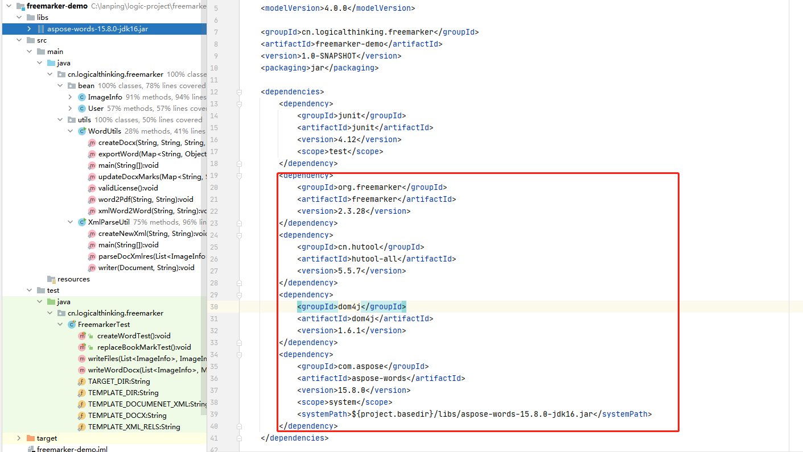
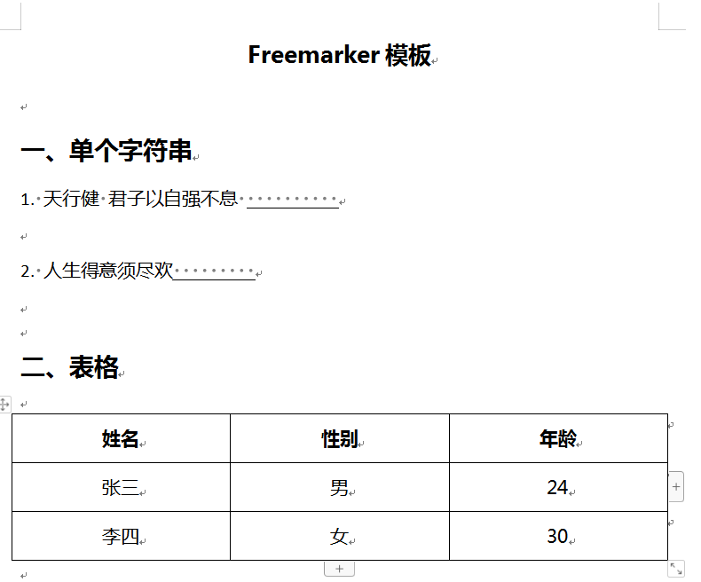
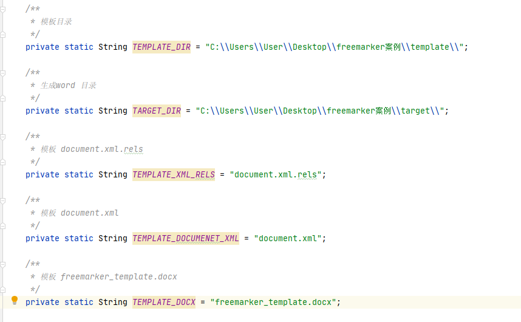
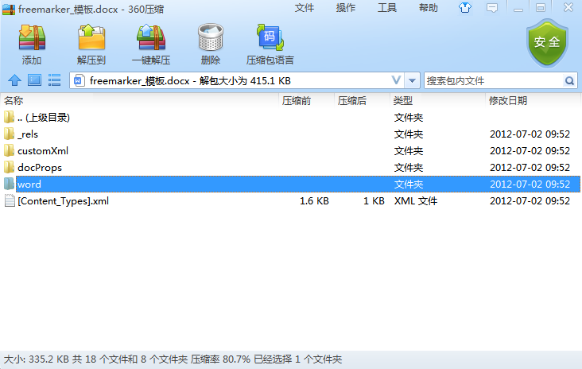
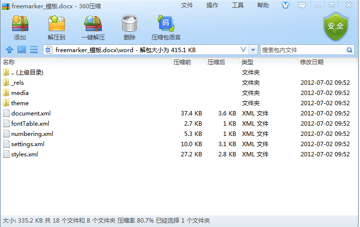

# Freemarker案例

主要用于生成特定word文档，需要替换docx中的文字，书签，图片，动态表格等

本文以生成docx为例，doc文件目前有一些问题 例如图片或模板不好处理等，暂不考虑。

思路：

1）熟悉docx文件的结构

2）重新生成docx中的文件

3）替换docx中的文件

# 一、引入依赖

pom.xml 引入相关jar包

##### 1.freemarker-2.3.28：处理xml或ftl模板的jar

##### 2.hutool-all-5.5.7：主要一些工具类的jar

##### 3.dom4j-1.6.1：XML解析使用的jar

##### 4.aspose-words-15.8.0-jdk16：对word操作的jar，例如word转pdf，word书签操作

# 二、构造参数

#####1.针对生成的word文档中需要的数据构造对象与属性

例如以下word模板

开发人员根据具体模板构造参数，不过多介绍

##### 2.代码书写

需要准备内容：模板目录，生成word文档目录，相关模板文件名称

例如：

document.xml.rels：实际上为xml文件，指定相关资源与图片地址的文件

document.xml：word文档内容文件

freemarker_template.docx：word模板文件

##### 3.执行顺序

1）通过dom4j进行xml解析 重新生成document.xml.rels

2）通过Freemarker进行模板处理重新生成document.xml

3）通过java自带zip操作替换word模板中的document.xml.rels，document.xml，写入相应图片，并且重新压缩生成新的word文档

4）删除临时文件：上述过程会产生一些临时文件，操作完成后需要及时删除

# 三、准备模板

docx文件实际是压缩文件，将word模板docx用压缩程序打开，如下：

将word目录中的document.xml文件，word/_rels/document.xml.rels文件拷贝出来，可以用HBuildX进行编辑，HBuildX可以对xml文件进行格式化。

document.xml.rels：

一般删除该文件中引入的图片标签即可

document.xml：

该word文档内容文件，需要开发人员自己编辑其内容 通过${}指定对应参数，这里使用的是Freemarker的语法格式

一般语法：

!'' 表示为空时为''，以下都做了非空判断，不然程序执行时会报错

    ${myName!''}
    
    ${(user.userName)!''}
    
    <#if ((user.type)!'')=='admin'>
        ${(user.userName)!''}
    </#if>
    
    <#if userList??>
        <#list userList as user>
            ${(user.userName)!''}
        </#list>
    </#if>

freemarker_template.docx：

这个文件是word模板文件，需要处理的是用压缩软件打开该文件后删除其中的图片，目录地址位于word/media/下，还需要处理的文件是[Content_Types].xml

一般添加以下内容即可（不添加时可能会提示错误）：

    <Default Extension="png" ContentType="image/png"/>
    
    <Default Extension="jpg" ContentType="image/jpg"/>
    
    <Default Extension="jpeg" ContentType="image/jpeg"/>
    

# 四、开始测试

具体测试请看demo